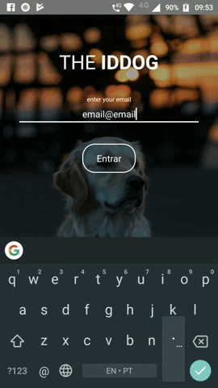

# IDDog

## Description
Just a project to training

## Summary
* Rest API from [Retrofit 2][1]
* Use [Picasso][2] to load and cache images.
* Use [Google ViewModel and LiveData][3] to store and manage UI-related data in a lifecycle.
* Use [Android View Animations][4] to animate some views.

## Preview

[1]: https://github.com/square/retrofit
[2]: https://github.com/square/picasso
[3]: https://developer.android.com/topic/libraries/architecture/adding-components
[4]: https://github.com/daimajia/AndroidViewAnimations
